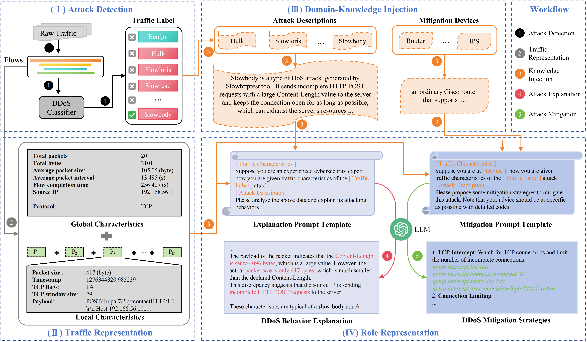

<div align="center">
<h1>ShieldGPT </h1>
<h3>An LLM-based Framework for DDoS Mitigation</h3>

[Tongze Wang](https://github.com/wangtz19), [Xiaohui Xie](https://thuxiexiaohui.github.io/), Lei Zhang, [Chuyi Wang](https://github.com/Judy456abc), Liang Zhang, [Yong Cui](https://www.cuiyong.net/index.html)

APNet 2024 ([paper](https://dl.acm.org/doi/10.1145/3663408.3663424))
</div>

## Overview
<div align="center">

</div>

## Classifier
Please refer to [NetMamba (recommended)](https://github.com/wangtz19/NetMamba) or [YaTC](https://github.com/NSSL-SJTU/YaTC).

## LLM
For prompt preparing, please refer to [dataset scripts](https://github.com/wangtz19/ShieldGPT/tree/master/datasets/cic-dos2017).

For offline generation, please refer to [chat](https://github.com/wangtz19/ShieldGPT/tree/master/chat).

For online generation, please refer to [test](https://github.com/wangtz19/ShieldGPT/tree/master/test).

## Contact Info
- Tongze Wang, Email: wangtz23@mails.tsinghua.edu.cn 

## Citation
```
@inproceedings{wang2024shieldgpt,
  title={ShieldGPT: An LLM-based framework for DDoS mitigation},
  author={Wang, Tongze and Xie, Xiaohui and Zhang, Lei and Wang, Chuyi and Zhang, Liang and Cui, Yong},
  booktitle={Proceedings of the 8th Asia-Pacific Workshop on Networking},
  pages={108--114},
  year={2024}
}
```